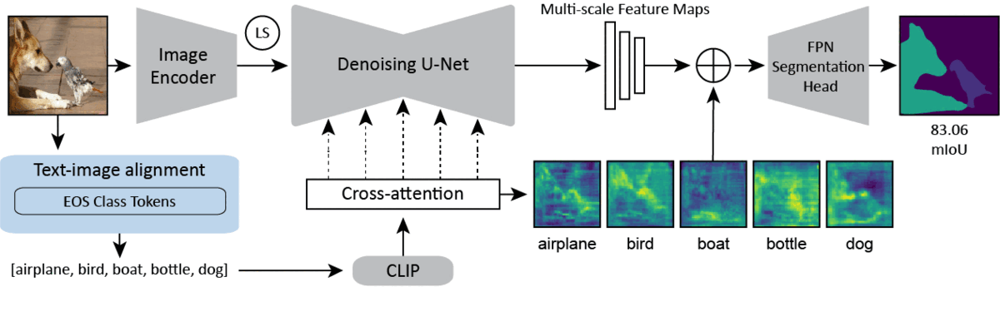

# Text-Image Alignment for Diffusion-based Perception 
# <div align="center">TADP</div>



Created by ...

This repo ...

# Abstract

# Setup

# Inference

# Training

# Experiments

# Acknowledgements
This code is based on [VPD](https://github.com/wl-zhao/VPD), [diffusers](https://github.com/wl-zhao/VPD), [stable-diffusion](https://github.com/CompVis/stable-diffusion), [mmsegmentation](https://github.com/open-mmlab/mmsegmentation), [LAVT](https://github.com/yz93/LAVT-RIS), and [MIM-Depth-Estimation](https://github.com/SwinTransformer/MIM-Depth-Estimation).

# Citation
```
@article{kondapaneni2023text,
  title={Text-image alignment for diffusion-based perception},
  author={Kondapaneni, Neehar and Marks, Markus and Knott, Manuel and Guimaraes, Rog{\'e}rio and Perona, Pietro},
  journal={arXiv preprint arXiv:2310.00031},
  year={2023}
}
```

